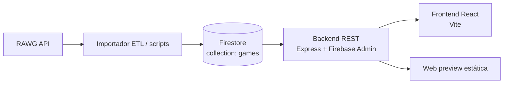

# Arquitectura del proyecto

Este repositorio implementa un catálogo de videojuegos con una arquitectura en capas. Los datos se importan desde RAWG, se normalizan y se guardan en Firestore. A partir de ahí, el backend expone una API REST y el frontend consume solo esa API.

La interfaz actual está completamente en castellano. Incluye una landing principal, una pantalla de acceso con inicio de sesión, registro, recuperación de contraseña y cookies, y una navegación donde el logo `GC` vuelve al catálogo principal.

## Estado actual de la interfaz

- El header se mantiene minimalista con `Iniciar sesión`, `Biblioteca` y `El proyecto`.
- El logo `GC` de la esquina superior izquierda actúa como retorno a la landing.
- La landing usa una estética oscura con tipografía grande y acentos en verde lima.
- La pantalla de acceso está dividida en dos zonas: a la izquierda hay un mashup visual de imágenes de videojuegos, y a la derecha está el formulario de inicio de sesión.
- La vista de `Registro` conserva los checkboxes de `Privacidad`, `Notificaciones` y `Recuérdame`, junto con el cierre `¿Ya tienes una cuenta? Inicia sesión`.
- `Recuperar contraseña` y `Cookies` siguen dentro del mismo flujo de acceso, pero en castellano.
- La cabecera del hero muestra un límite visual de `1.000` títulos para mantener coherencia con la presentación actual.

## Vista general

## Responsabilidades

- RAWG es la fuente externa de verdad para la importación inicial y las actualizaciones del catálogo.
- El ETL descarga páginas, normaliza los campos y escribe en Firestore de forma idempotente.
- Firestore actúa como base de datos maestra del proyecto.
- El backend es la única capa autorizada para leer Firestore desde la aplicación y para exponer el contrato HTTP.
- El frontend presenta la información, aplica filtros de interfaz y nunca accede directamente a Firestore.
- La vista principal del frontend está traducida al castellano y muestra la landing del catálogo, el acceso de usuario y las pantallas de registro, recuperación de contraseña y cookies.
- La preview `web/` existe como demo estática independiente del stack Node.

## Flujo de datos

1. El importador consulta RAWG y obtiene juegos paginados.
2. Cada resultado se transforma al modelo interno `games`.
3. El documento se guarda en Firestore usando un identificador estable.
4. El backend lee Firestore, valida entradas HTTP y devuelve respuestas uniformes.
5. El frontend solicita `GET /games` y renderiza el catálogo.
6. El logo `GC` del header vuelve a la landing cuando se pulsa desde la vista de acceso.

## Capas del sistema

### 1. Fuente externa

RAWG aporta el contenido original. El proyecto no depende de su estructura en tiempo de lectura del frontend, porque esa complejidad queda confinada al ETL y al backend.

La interfaz de usuario no consume directamente RAWG; solo interactúa con la API propia.

### 2. ETL y scripts

La carpeta `scripts/` separa las tareas operativas del producto web. Su responsabilidad es extraer, transformar y cargar datos al modelo interno sin acoplarse a la UI.

Principios del importador:

- leer páginas respetando límites de peticiones;
- normalizar cada registro al esquema del proyecto;
- usar operaciones idempotentes para evitar duplicados;
- registrar errores sin detener toda la importación;
- conservar métricas de proceso, éxito y fallo.

### 3. Persistencia

Firestore almacena la colección `games`. El documento usa el ID de Firestore como identificador público y el backend lo normaliza a texto en las respuestas HTTP.

Campos principales del modelo:

- `id`: identificador estable del documento.
- `name`: nombre del juego.
- `rating`: valoración, opcional.
- `released`: fecha de lanzamiento en formato ISO, opcional.
- `background_image`: portada, opcional.
- `platforms`: lista de plataformas.

### 4. Backend

El backend está en `scripts/backend/` y usa Express, TypeScript, Firebase Admin, Zod y CORS.

Responsabilidades principales:

- exponer la API REST;
- validar parámetros de entrada;
- aplicar paginación y búsqueda;
- leer Firestore a través de un repositorio;
- devolver errores HTTP consistentes;
- servir un endpoint de salud.

Rutas principales:

- `GET /health`: verificación básica del servicio.
- `GET /games`: listado paginado de juegos.
- `GET /games/search`: búsqueda por nombre.
- `GET /games/top-rated`: listado de mejor valorados.
- `GET /games/:id`: detalle de un juego.

El repositorio de juegos normaliza los documentos de Firestore antes de exponerlos. Si un campo falta o tiene un tipo inesperado, el backend devuelve un valor seguro como `null`, `[]` o cadena vacía.

### 5. Frontend

El frontend está en `frontend/` y está montado con Vite + React. Consume la API mediante `VITE_API_URL`, que por defecto apunta a `http://localhost:3000`.

Su responsabilidad es exclusivamente de presentación:

- cargar el catálogo desde `/games`;
- filtrar por búsqueda, plataforma, rating y orden;
- paginar resultados en la interfaz;
- mostrar estados de carga y error;
- no conocer la estructura interna de Firestore.

La pantalla de acceso actual incluye:

- inicio de sesión;
- registro;
- recuperación de contraseña;
- cookies.

El acceso está separado visualmente de la landing, pero el logo `GC` vuelve a la portada principal cuando se hace clic.

La interfaz del catálogo muestra un límite visual de 1.000 títulos en el hero, aunque el sistema puede seguir adaptándose al volumen real de datos desde Firestore.

### 6. Preview estática

`web/index.html` es una demostración sin dependencias de Node. Sirve como vista rápida para abrir el proyecto en el navegador y probar búsquedas locales con datos de ejemplo.

## Contratos y seguridad

- El backend es la única capa que debe acceder a Firestore desde las aplicaciones.
- Las credenciales de Firebase no deben subirse al repositorio.
- El servicio puede configurarse con variables de entorno o con un JSON de cuenta de servicio.
- El frontend nunca debe leer secretos ni hablar directamente con Firestore.

## Despliegue

El archivo `render.yaml` define dos servicios:

- backend Node/Express para la API;
- frontend React estático para la interfaz.

En despliegue, el backend publica la API y el frontend consume la URL pública configurada en entorno.

## Estructura del repositorio

- `docs/`: documentación de arquitectura, datos, ETL y flujo Git.
- `scripts/`: importadores y tareas operativas.
- `scripts/backend/`: API REST y acceso a Firestore.
- `frontend/`: aplicación React.
- `web/`: preview estática independiente.

## Resumen operativo

La regla central de la arquitectura es simple: RAWG alimenta Firestore, Firestore alimenta el backend y el backend alimenta al frontend. Eso mantiene separadas la ingesta, la persistencia y la interfaz, y hace más fácil cambiar cada pieza sin romper las demás.
