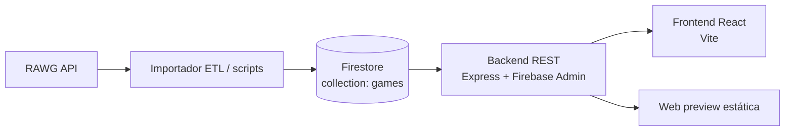

# Arquitectura del proyecto

Este repositorio implementa un catálogo de videojuegos con una arquitectura en capas. Los datos del catálogo se importan desde RAWG, se normalizan y se guardan en Firestore. A partir de ahí, el backend expone una API REST y el frontend consume solo esa API.

La interfaz está completamente en castellano. Incluye una landing principal, una pantalla de acceso con inicio de sesión, registro, recuperación de contraseña y cookies, y una navegación donde el logo `GC` vuelve al catálogo principal. El catálogo de juegos queda bloqueado hasta que Firebase Auth confirme la sesión y el correo del usuario.
Por ahora todo el proyecto se ejecuta en local: no hay despliegue activo ni contrato de URL pública.

## Estado actual de la interfaz

- El header se mantiene minimalista con `Iniciar sesión`, `Biblioteca` y `El proyecto`.
- El logo `GC` de la esquina superior izquierda actúa como retorno a la landing.
- La landing usa una estética oscura con tipografía grande, ruido visual controlado y acentos en verde lima.
- El hero principal muestra dos carátulas destacadas que cambian al entrar en la página y al refrescar, tomadas de un pequeño pool cacheado para no gastar lecturas de Firebase.
- La pantalla de acceso está dividida en dos zonas: a la izquierda hay un panel de marca con el logo `GC`, y a la derecha está el formulario activo.
- El flujo de acceso incluye `login`, `registro`, `recuperar contraseña`, `cookies` y `perfil`.
- El botón `Saltar por ahora` solo existe en el onboarding de registro.
- La vista de `Registro` conserva los checkboxes de `Privacidad`, `Notificaciones` y `Recuérdame`, junto con el cierre `¿Ya tienes una cuenta? Inicia sesión`.
- `Recuperar contraseña` y `Cookies` siguen dentro del mismo flujo de acceso, pero en castellano.
- El perfil se presenta como una burbuja sin avatar, con iniciales o símbolo de marca, y se puede abrir desde el header cuando la sesión está activa.
- La vista de perfil tiene pestañas para `Datos`, `Guardados` y `Historial`.
- El usuario puede guardar juegos, marcarlos como favoritos y ver un historial reciente de juegos abiertos.
- El frontend crea y lee el perfil de usuario en la colección `users` de Firestore únicamente después de iniciar sesión con correo verificado.
- La cuenta de inicio de sesión se ve en Firebase Authentication, y el perfil de usuario se ve en Firestore dentro de `users/{uid}`.

## Vista general



## Responsabilidades

- RAWG es la fuente externa de verdad para la importación inicial y las actualizaciones del catálogo.
- El ETL descarga páginas, normaliza los campos y escribe en Firestore de forma idempotente.
- Firestore actúa como base de datos maestra del proyecto para `games` y `users`.
- El backend es la única capa autorizada para leer la colección compartida `games` y para exponer el contrato HTTP del catálogo.
- El frontend presenta la información, aplica filtros de interfaz y usa Firebase Auth/Firestore únicamente para el documento privado `users/{uid}` del usuario activo.
- La vista principal del frontend está traducida al castellano y muestra la landing del catálogo, el acceso de usuario y las pantallas de registro, recuperación de contraseña, cookies y perfil.
- La preview `web/` existe como demo estática independiente del stack Node.

## Flujo de datos

1. El importador consulta RAWG y obtiene juegos paginados.
2. Cada resultado se transforma al modelo interno `games`.
3. El documento se guarda en Firestore usando un identificador estable.
4. El backend lee Firestore, valida entradas HTTP y devuelve respuestas uniformes.
5. El frontend solicita `GET /games` solo si existe sesión autenticada y verificada.
6. El frontend solicita `GET /games/featured` sin autenticación para pintar el hero público de la landing.
7. El frontend registra guardados, favoritos e historial reciente en `users/{uid}`.
8. El logo `GC` del header vuelve a la landing cuando se pulsa desde la vista de acceso.

## Mapa del repositorio

La estructura separa documentación, interfaz, servidor y datos de configuración. Cada carpeta tiene una responsabilidad concreta:

### Raíz

- `README.md`: punto de entrada para instalar, configurar y arrancar el proyecto.
- `package.json`: workspaces npm y comandos comunes de desarrollo, build y typecheck.
- `package-lock.json`: versiones exactas de las dependencias instaladas.
- `firestore.rules`: reglas recomendadas para proteger `users` y `games`.
- `.gitignore`: evita subir credenciales, entornos, dependencias y salidas generadas.

### `docs/`

Contiene la explicación técnica, separada del código ejecutable.

- `architecture.md`: visión general, capas, contratos, seguridad y coste.
- `data-model.md`: estructura de `games` y `users/{uid}`.
- `etl.md`: extracción, transformación y carga desde RAWG.
- `git-workflow.md`: organización y validación de cambios.

### `frontend/`

Es el workspace de Vite, React y TypeScript. Contiene la experiencia visual y el estado de sesión.

- `src/main.tsx`: composición de la aplicación, autenticación, navegación, landing, biblioteca, perfil y acciones de tarjetas.
- `src/firebase.ts`: Firebase Auth y acceso del cliente al perfil privado `users/{uid}`.
- `src/styles.css`: estilos globales, layouts, responsive y estados visuales.
- `src/vite-env.d.ts`: declaraciones de tipos específicas de Vite.
- `index.html`: punto HTML que monta React.
- `vite.config.ts`: servidor local de Vite y plugin de React.
- `tsconfig.json`: configuración del compilador TypeScript.
- `.env` y `.env.example`: configuración local real y plantilla de variables.
- `package.json`: dependencias y comandos del frontend.

Las carpetas `frontend/dist/` y `frontend/node_modules/` son generadas localmente. La primera contiene la compilación y la segunda las dependencias; ninguna debe editarse manualmente.

### `scripts/`

Agrupa tareas operativas y servicios que no pertenecen directamente a la interfaz. El archivo `.gitkeep` mantiene la carpeta raíz disponible para futuros scripts.

### `scripts/backend/`

Es el workspace del servidor Express local. Su función es acceder al catálogo compartido, validar sesiones y ofrecer la API.

- `src/server.ts`: crea el servidor, registra middleware, health check, endpoint público de destacados y rutas protegidas.
- `src/config.ts`: carga variables de entorno del servidor.
- `src/firebase.ts`: inicializa Firebase Admin y Firestore.
- `src/repositories/`: encapsula las consultas a Firestore.
  - `gameRepository.ts`: consulta, pagina, busca y normaliza juegos; también cachea el pool destacado.
- `src/routes/`: agrupa endpoints HTTP por recurso.
  - `games.ts`: listado, búsqueda, top-rated y detalle.
- `src/types/`: tipos del dominio del backend.
  - `game.ts`: modelo de juego y parámetros de consulta.
- `.env` y `.env.example`: configuración local real y plantilla.
- `credentials/`: credenciales privadas de Firebase Admin para desarrollo local; está excluida de Git.
- `tsconfig.json`: compilación TypeScript del servidor.
- `package.json`: comandos `dev`, `build`, `start` y `typecheck`.

Las carpetas `scripts/backend/dist/` y `scripts/backend/node_modules/` son salidas generadas y dependencias instaladas. No forman parte de la lógica fuente.

### `web/`

Contiene una preview HTML independiente. Existe para visualizar una demo local con datos de ejemplo sin iniciar el backend, pero no incluye Firebase Auth ni la biblioteca real.

### Qué no se edita manualmente

No se deben modificar directamente `node_modules/`, `dist/`, archivos `.env`, credenciales ni archivos generados por TypeScript. El código fuente está en `frontend/src/` y `scripts/backend/src/`.

## Capas del sistema

### 1. Fuente externa

RAWG aporta el contenido original. El proyecto no depende de su estructura en tiempo de lectura del frontend, porque esa complejidad queda confinada al ETL y al backend.

La interfaz de usuario no consume directamente RAWG; solo interactúa con la API propia.

### 2. ETL y scripts

La carpeta `scripts/` separa las tareas operativas del producto web. Su responsabilidad es extraer, transformar y cargar datos al modelo interno sin acoplarse a la UI.

Principios del importador:

- leer páginas respetando límites de peticiones;
- normalizar cada registro al esquema del proyecto;
- usar operaciones idempotentes para evitar duplicados;
- registrar errores sin detener toda la importación;
- conservar métricas de proceso, éxito y fallo.

### 3. Persistencia

Firestore almacena dos áreas principales:

- `games`: catálogo normalizado de videojuegos.
- `users`: perfiles, preferencias y colecciones personales.

El documento de juego usa el ID de Firestore como identificador público y el backend lo normaliza a texto en las respuestas HTTP.

Campos principales del modelo `games`:

- `id`: identificador estable del documento.
- `name`: nombre del juego.
- `rating`: valoración, opcional.
- `released`: fecha de lanzamiento en formato ISO, opcional.
- `background_image`: portada, opcional.
- `platforms`: lista de plataformas.

Campos principales del perfil `users/{uid}`:

- `uid`: identificador del usuario autenticado.
- `email`: correo usado para el acceso.
- `displayName`: nombre visible.
- `fullName`: nombre personal editable, separado del nombre público.
- `emailVerified`: estado de verificación.
- `registeredAt`: fecha de alta.
- `lastLoginAt`: fecha del último acceso.
- `bio`: biografía corta editable.
- `favoritePlatform`: plataforma favorita.
- `favoriteGenre`: género favorito.
- `favoriteGame`: juego favorito.
- `avatarImage`: enlace externo o imagen local pequeña para la burbuja.
- `avatarColor`: color de la paleta por defecto cuando no hay imagen.
- `savedGames`: lista de IDs guardados.
- `favoriteGames`: lista de IDs favoritos.
- `recentlyViewedGames`: lista de IDs vistos recientemente.

### 4. Backend

El backend está en `scripts/backend/` y usa Express, TypeScript, Firebase Admin, Zod y CORS.

Responsabilidades principales:

- exponer la API REST;
- validar parámetros de entrada;
- aplicar paginación y búsqueda;
- leer Firestore a través de un repositorio;
- devolver errores HTTP consistentes;
- servir un endpoint de salud;
- proteger el catálogo completo con un token válido y correo verificado.

Rutas principales:

- `GET /health`: verificación básica del servicio.
- `GET /games`: listado paginado de juegos, protegido por sesión verificada.
- `GET /games/search`: búsqueda por nombre.
- `GET /games/top-rated`: listado de mejor valorados.
- `GET /games/:id`: detalle de un juego.
- `GET /games/featured`: selección pública y cacheada para la landing.

El middleware de seguridad del backend comprueba que exista un Bearer token de Firebase y que el correo esté verificado. Si no, devuelve `401` o `403` según el caso.

El repositorio de juegos normaliza los documentos de Firestore antes de exponerlos. Si un campo falta o tiene un tipo inesperado, el backend devuelve un valor seguro como `null`, `[]` o cadena vacía.

### 5. Frontend

El frontend está en `frontend/` y está montado con Vite + React. Consume la API mediante `VITE_API_URL`, que en local apunta a `http://localhost:3002`.

Su responsabilidad es exclusivamente de presentación y estado de interfaz:

- cargar el catálogo desde `/games` cuando existe sesión verificada;
- cargar el hero desde `/games/featured` sin pedir autenticación;
- filtrar por búsqueda, plataforma, rating y orden;
- paginar resultados en la interfaz con páginas de 20 juegos;
- mostrar estados de carga y error;
- no conocer la estructura interna de Firestore;
- mantener el estado del perfil, guardados, favoritos e historial reciente.

La pantalla de acceso actual incluye:

- inicio de sesión;
- registro;
- recuperación de contraseña;
- cookies;
- perfil.

El acceso está separado visualmente de la landing, pero el logo `GC` vuelve a la portada principal cuando se hace clic.

El onboarding de registro es el único sitio donde existe el salto temporal `Saltar por ahora`.

La interfaz del catálogo ya no intenta cargar toda la biblioteca de golpe. En su lugar:

- solicita `limit=21` y usa `offset` por página;
- muestra solo los primeros 20 juegos de cada respuesta;
- utiliza el juego 21 como indicador de que existe una página siguiente;
- reduce mucho el coste de lecturas en Firebase respecto a una carga masiva.

La vista de perfil evita cualquier avatar fijo. La burbuja se construye con letras derivadas del nombre o del correo, y el contenido se organiza en pestañas:

- `Datos`: nombre público, nombre personal, biografía y gustos principales;
- `Guardados`: juegos guardados y favoritos;
- `Historial`: juegos abiertos recientemente.

La burbuja puede usar las iniciales por defecto, un color de la paleta integrada, un enlace de imagen o una imagen local. Las imágenes locales se convierten en Data URL y se limitan a 300 KB; no se añade un servicio de almacenamiento separado.

Cada tarjeta de juego incluye acciones para:

- guardar o quitar de guardados;
- marcar o desmarcar como favorito;
- abrir ficha, lo que registra el juego en el historial reciente.

### 6. Preview estática

`web/index.html` es una demostración sin dependencias de Node. Sirve como vista rápida para abrir el proyecto en el navegador y probar búsquedas locales con datos de ejemplo.

## Ejecución local

El flujo de arranque actual está pensado solo para desarrollo local.

- Backend: `scripts/backend/` con `PORT=3002`.
- Frontend: `frontend/` con `VITE_API_URL=http://localhost:3002`.
- Firebase Auth y Firestore se usan desde el frontend y el backend con las credenciales de desarrollo configuradas en variables de entorno.
- El hero destacado y la biblioteca dependen de la API local, no de una URL pública.
- La demo estática de `web/` también se abre localmente y no sustituye al frontend principal.

## Contratos y seguridad

- El backend es la única capa que debe acceder a la colección compartida `games` desde la aplicación.
- Las credenciales de Firebase no deben subirse al repositorio.
- El servicio puede configurarse con variables de entorno o con un JSON de cuenta de servicio.
- El frontend nunca debe leer secretos ni acceder directamente a `games`; solo puede leer y actualizar el perfil privado `users/{uid}` del usuario autenticado.
- Los datos privados de usuario viven en `users/{uid}` y solo pueden ser consultados por el propio usuario.
- El catálogo completo solo debe ser visible con correo verificado.

## Firebase y variables de entorno

Ejemplo de `frontend/.env`:

```bash
VITE_API_URL=http://localhost:3002
VITE_FIREBASE_API_KEY=AIzaSyXXXXXXXXXXXXXXX
VITE_FIREBASE_AUTH_DOMAIN=tu-proyecto.firebaseapp.com
VITE_FIREBASE_PROJECT_ID=tu-proyecto
VITE_FIREBASE_APP_ID=1:1234567890:web:abcdef123456
VITE_FIREBASE_STORAGE_BUCKET=tu-proyecto.appspot.com
VITE_FIREBASE_MESSAGING_SENDER_ID=1234567890
```

Ejemplo de `scripts/backend/.env`:

```bash
PORT=3002
FIREBASE_PROJECT_ID=tu-proyecto
GOOGLE_APPLICATION_CREDENTIALS=Credentials/firebase-service-account.json
```

Reglas de Firestore recomendadas:

```rules
rules_version = '2';

service cloud.firestore {
  match /databases/{database}/documents {
    match /users/{uid} {
      allow read, write: if request.auth != null && request.auth.uid == uid;
    }

    match /games/{documentId} {
      allow read: if request.auth != null && request.auth.token.email_verified == true;
      allow write: if false;
    }
  }
}
```

Para pegarlas en la consola: abre Firebase Console, entra en el proyecto, ve a `Build > Firestore Database > Rules`, pega el contenido y pulsa `Publish`.

## Optimización de coste

Este proyecto ya incorpora varias medidas para no agotar lecturas en el plan gratuito:

- el hero destacado usa un pool pequeño de 20 juegos;
- ese pool se cachea en memoria durante 30 minutos;
- la biblioteca pagina resultados en bloques de 20;
- las colecciones del usuario guardan solo IDs y no copian fichas completas;
- el hero destacado es público y no necesita autenticación.

La consecuencia práctica es que la primera carga de la landing y la navegación posterior consumen muchas menos lecturas que una estrategia de catálogo completo sin paginación.

## Estructura del repositorio

- `docs/`: documentación de arquitectura, datos, ETL y flujo Git.
- `scripts/`: importadores y tareas operativas.
- `scripts/backend/`: API REST y acceso a Firestore.
- `frontend/`: aplicación React.
- `web/`: preview estática independiente.

## Resumen operativo

La regla central de la arquitectura es simple: RAWG alimenta Firestore, Firestore alimenta el backend y el backend alimenta al frontend. La diferencia actual es que el frontend ya no es solo una vista pasiva: también gestiona sesión verificada, perfil, colecciones personales y un historial local de interacción, todo sin romper la separación entre ingesta, persistencia y presentación.

En esta fase, el objetivo es que todo funcione en local antes de pensar en cualquier despliegue.
